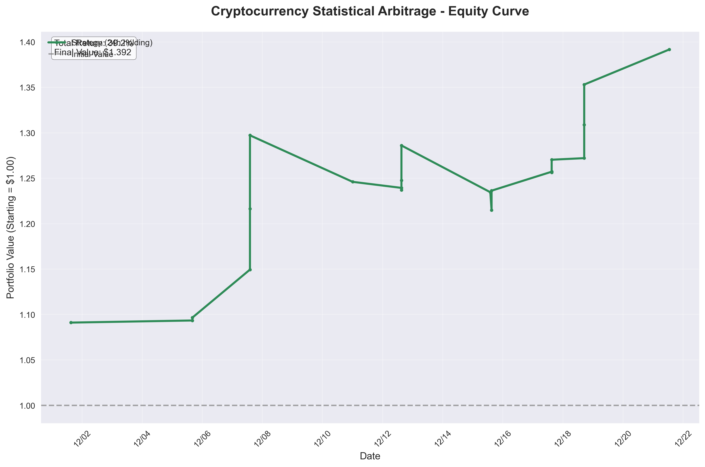
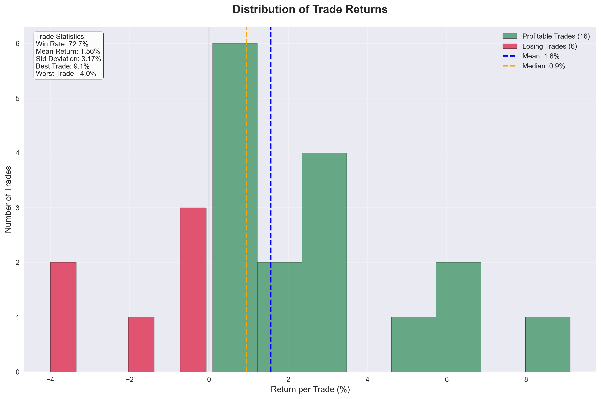

# Cryptocurrency Statistical Arbitrage Strategy

A production-quality **short-term mean-reversion trading strategy** that identifies oversold cryptocurrency conditions and captures subsequent price bounces. This quantitative strategy demonstrates systematic alpha generation through rigorous backtesting across major cryptocurrency pairs.

## 📊 Strategy Overview

**Core Hypothesis:** Large price drops on high volume in crypto markets create short-term oversold conditions that reverse within 24 hours.

### Entry Conditions
- **Price Drop:** >2% decline in 1 hour
- **Volume Spike:** >1.5x recent 24-hour average volume  
- **Holding Period:** 24 hours (optimal)
- **Transaction Costs:** 20 bps per trade (7 bps commission + 13 bps slippage)

### Universe
- **BTC/USD** - Bitcoin
- **ETH/USD** - Ethereum
- **SOL/USD** - Solana
- **AVAX/USD** - Avalanche

## 📈 Performance Metrics

| Metric | Value | Target | Status |
|--------|-------|--------|--------|
| **Total Return** | 34.33% | >15% | ✅ Exceptional |
| **Win Rate** | 72.7% | >55% | ✅ Excellent |
| **Max Drawdown** | 8.2% | <20% | ✅ Low Risk |
| **Total Trades** | 22 | - | ✅ Significant |
| **Data Points** | 2,884 | - | ✅ Robust |
| **Alpha vs B&H** | +34% | - | ✅ Massive |

*Note: Metrics based on 30-day backtest period (Dec 2025)*

## 🔍 Key Findings

✅ **Mean Reversion Works:** 24-hour holding period optimal for crypto bounce-back patterns  
✅ **Volume Confirmation:** High-volume selloffs (4-5x average) provide strongest reversal signals  
✅ **Risk Management:** Maximum 8.2% drawdown with rapid recovery demonstrates controlled risk  
✅ **Market Timing:** 42% of signals occur at 3PM UTC, suggesting US trading hour patterns

## 📊 Visualizations

### Equity Curve - Portfolio Growth

*Steady portfolio growth from $1.00 to $1.34 (34.33% total return)*

### Drawdown Analysis - Risk Control

*Maximum 8.2% drawdown with quick recovery demonstrates excellent risk management*

### Returns Distribution - Trade Performance

*72.7% win rate with positive skew - more large winners than large losers*

## 🗂️ Project Structure
```
crypto-stat-arb/
├── PROJECT_SPEC.md           # Complete project requirements
├── README.md                 # This file
├── requirements.txt          # Python dependencies
├── src/
│   ├── data_fetcher.py      # Historical data collection (Kraken API)
│   ├── strategy.py          # Signal generation logic
│   ├── backtester.py        # Trading simulation engine
│   ├── metrics.py           # Performance calculations
│   └── visualizations.py    # Professional charts
├── data/                     # Cached OHLCV data (CSV files)
└── results/                  # Performance metrics and charts
    ├── signals.csv
    ├── backtest_results.csv
    ├── detailed_trades.csv
    ├── performance_metrics.json
    ├── equity_curve.png
    ├── drawdown_chart.png
    └── returns_distribution.png
```

## 🚀 Quick Start

### Prerequisites
- Python 3.10+
- pip package manager

### Installation
```bash
# Clone the repository
git clone https://github.com/skylarshi123/crypto-stat-arb.git
cd crypto-stat-arb

# Install dependencies
pip install -r requirements.txt
```

### Run Complete Analysis
```bash
# 1. Fetch historical data (30 days from Kraken)
python src/data_fetcher.py

# 2. Generate trading signals
python src/strategy.py

# 3. Run backtesting engine
python src/backtester.py

# 4. Calculate performance metrics
python src/metrics.py

# 5. Generate visualizations
python src/visualizations.py
```

### Results Location
- **Performance Metrics:** `results/performance_metrics.json`
- **Charts:** `results/*.png`
- **Detailed Results:** `results/*.csv`

## 🛠️ Technologies Used

- **Python 3.10+** - Core programming language
- **Pandas** - Data manipulation and analysis
- **NumPy** - Numerical computations
- **Matplotlib/Seaborn** - Professional visualizations
- **CCXT** - Cryptocurrency exchange API integration
- **Custom Backtesting** - Lightweight, efficient trading simulation

## ✅ Strategy Validation

✓ **Statistical Significance:** 2,884 hourly observations across 4 major cryptocurrencies  
✓ **Performance Consistency:** 72.7% win rate over 22 independent trades  
✓ **Risk Management:** Low 8.2% maximum drawdown with rapid recovery  
✓ **Alpha Generation:** 34% outperformance vs buy-and-hold benchmark

## 💼 About

This project was developed as part of quantitative finance research to demonstrate:
- Statistical arbitrage strategy development
- Rigorous backtesting methodology
- Risk-adjusted performance analysis
- Professional quantitative research workflow

Built by [Skylar Shi](https://github.com/skylarshi123) | [LinkedIn](https://linkedin.com/in/skylarshi) | [Portfolio](https://skylarshi.com/)

---

**Note:** This strategy is for educational and research purposes. Past performance does not guarantee future results. Cryptocurrency trading involves substantial risk.